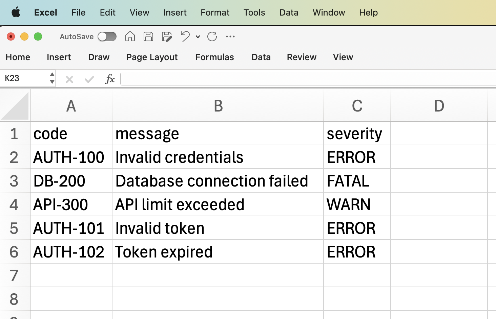
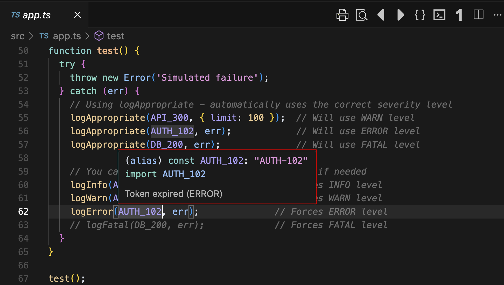

# Error Code Management System


<a target="_blank" href="https://github.com/Siphon880gh" rel="nofollow"></a>
<a target="_blank" href="https://www.linkedin.com/in/weng-fung/" rel="nofollow"></a>
<a target="_blank" href="https://www.youtube.com/@WayneTeachesCode/" rel="nofollow"></a>

By Weng Fei Fung. Frustrated with messy error handling, I built a type-safe error code system with full VS Code IntelliSense support. It enforces best practices by limiting console output to info and warn logs, while routing critical errors to private log files—optionally capped by line count for easier management. Each error includes a structured code and a clear, human-readable description to make issues easier to understand, report, and debug.

The system is fully configurable across environments (development, staging, production), and it maintains a synced CSV file of errors to serve as a centralized, editable catalog for the entire team. Thanks to IntelliSense integration, developers can hover over any error code in VS Code and instantly preview its description—making it fast and intuitive to use the right codes in the right context.

## Features

- Centralized error code management in CSV
- Type-safe error codes in TypeScript
- VS Code IntelliSense hover tooltips
- Auto-generated TypeScript definitions
- Support for multiple severity levels (INFO, WARN, ERROR, FATAL)
- Environment-specific logging configurations
- Configurable log levels with JSON-based configuration

## How It Works

### 1. Error Code Definition (src/data/error-codes/input.csv)
```csv
code,message,severity
AUTH-100,Invalid credentials,ERROR
DB-200,Database connection failed,FATAL
API-300,API limit exceeded,WARN
USER-400,User preferences updated,INFO
```

> Pro Tip: Have the team use Excel 
> 

### 2. Log Levels Configuration (src/config/levels/input.json)
```json
{
  "levels": {
    "INFO": {
      "description": "Informational messages that don't indicate problems",
      "consoleAllowed": true,
      "fileRequired": true
    },
    "WARN": {
      "description": "Warning messages that might indicate potential issues",
      "consoleAllowed": true,
      "fileRequired": true
    },
    "ERROR": {
      "description": "Error messages that indicate actual problems",
      "consoleAllowed": false,
      "fileRequired": true
    },
    "FATAL": {
      "description": "Critical errors that require immediate attention",
      "consoleAllowed": false,
      "fileRequired": true
    }
  }
}
```

### 3. Auto-generated TypeScript (src/data/error-codes/generated.ts)
The generator creates TypeScript code with JSDoc comments that enable IntelliSense:

```typescript
/** Invalid credentials */
export const AUTH_100 = ERROR_CODES.AUTH_100.code;
```

### 4. IntelliSense Hover Tooltips
When you hover over an error code constant in VS Code, IntelliSense shows:
- The error message from the JSDoc comment
- The severity level
- The type information
- The constant value

Example:
```typescript
logError(AUTH_100, err); // Hover over AUTH_100 to see "Invalid credentials (ERROR)"
```

> Hover your mouse over the error code
> 

### 5. Type Safety
The system ensures type safety through:
- Strict TypeScript types
- Constant assertions
- Record type for error messages
- Enum for severity levels

## Usage

1. Add error codes to `src/data/error-codes/input.csv` with appropriate severity levels
2. Configure log levels in `src/config/levels/input.json`
3. Run `npm run generate` to update TypeScript definitions
4. Import and use error codes in your code:
```typescript
import { AUTH_100, USER_400 } from './src/data/error-codes/generated';

// Log with different severity levels
logError(AUTH_100, err);    // ERROR level
logInfo(USER_400, data);    // INFO level
logWarn(API_300, limit);    // WARN level
logFatal(DB_200, connErr);  // FATAL level
```

## Severity Levels

The system supports four severity levels, each configurable in `src/config/levels/input.json`:

- **INFO**: Informational messages that don't indicate problems
  - Console output allowed
  - File logging required
- **WARN**: Warning messages that might indicate potential issues
  - Console output allowed
  - File logging required
- **ERROR**: Error messages that indicate actual problems
  - Console output disabled
  - File logging required
- **FATAL**: Critical errors that require immediate attention
  - Console output disabled
  - File logging required

## Environment Configuration

Logging behavior can be configured per environment in `src/config/environments.json`:
- Development: Console logging enabled for INFO and WARN
- Staging: Console logging enabled for INFO and WARN
- Production: Console logging disabled, all levels written to file

## How IntelliSense Works

The IntelliSense hover tooltip is powered by:
1. JSDoc comments in the generated TypeScript
2. TypeScript's type system
3. VS Code's language server

When you hover over a constant like `AUTH_100`, VS Code:
1. Reads the JSDoc comment `/** Invalid credentials */`
2. Combines it with severity level and type information
3. Displays it in a tooltip

This provides immediate documentation without leaving your code.

if (process.env.NODE_ENV === 'production') {
  // Production-specific code
  // - Disable detailed error messages
  // - Enable caching
  // - Use production database
  // - Enable compression
  // - Set up security headers
}

## Future Plans

This system will be released as an npm package, allowing you to:

1. Install via npm:
```bash
npm install error-code-manager
```

2. Use in your project:
```typescript
import { ErrorCodeManager } from 'error-code-manager';

const manager = new ErrorCodeManager({
  // Your configuration here
});
```

3. Features planned for the plugin:
   - Custom log level definitions
   - Multiple output formats (JSON, CSV, YAML)
   - Custom log formatters
   - Integration with popular logging libraries
   - CLI tools for code generation
   - VS Code extension for better IDE support
   - Custom severity level definitions
   - Environment-specific configurations
   - Log rotation and management
   - Performance optimizations

Stay tuned for the release!
